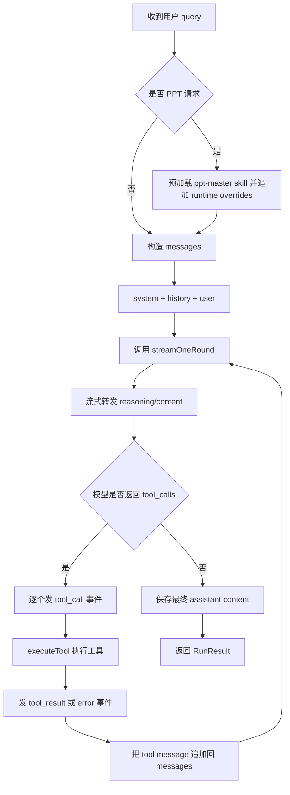
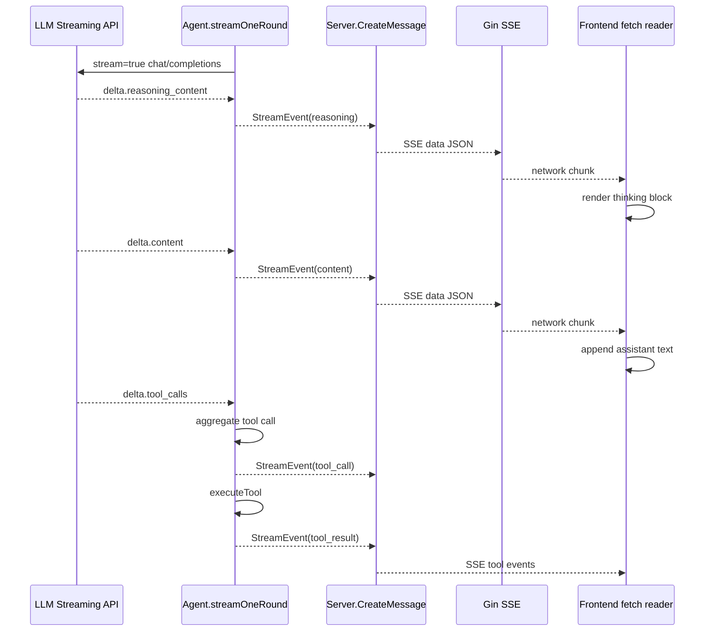
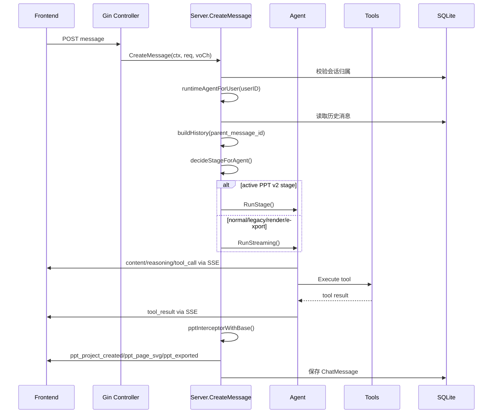
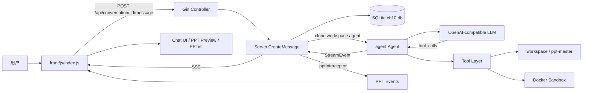

# Lingxi Agent 相关逻辑报告

## 1. 范围与结论

本文档梳理本项目中 Agent 相关的主要实现，包括后端 Agent loop、工具系统、PPT 生成流水线、SSE 事件传输、会话历史持久化和前端消费逻辑。

当前项目的 Agent 本质是一个基于 OpenAI Chat Completions 兼容接口的工具调用循环：

- 后端通过 `background/main/main.go` 读取配置、初始化数据库、注册工具并创建 `agent.Agent`。
- `background/agent/agent.go` 负责模型流式调用、tool call 执行、工具结果回填和最终响应聚合。
- `background/server/service.go` 负责鉴权后的用户隔离、会话历史构建、SSE 转发、PPT 事件拦截和消息落库。
- `front/js/index.js` 负责解析 SSE、渲染思考过程、工具调用、PPT 生成进度和 PPT 预览。

需要注意：这个 Agent 有工具循环、历史上下文、reasoning 流式展示、PPT 专用工作流和 Docker 沙箱，但它不是完整的 Codex/Claude Code 等价体。它更接近“面向本项目 PPT 生成场景定制的 LLM 工具编排器”。

## 2. 关键文件

| 模块 | 文件 | 职责 |
| --- | --- | --- |
| 启动装配 | `background/main/main.go` | 加载 `config.json`、初始化 SQLite、解析路径、注册工具、启动 Gin 服务 |
| Agent 核心 | `background/agent/agent.go` | Agent 结构体、系统提示词、模型调用、tool loop、PPT 模式预加载 skill |
| 流式事件 | `background/agent/stream.go` | 定义 `StreamEvent` 和事件类型 |
| PPT v2 状态机 | `background/agent/ppt_pipeline.go` | PPT 阶段、状态、工具白名单、tag 校验、阶段 prompt |
| PPT v2 执行 | `background/agent/run_stage.go` | 单阶段执行、超时控制、工具白名单执行、阶段结果推进 |
| 服务编排 | `background/server/service.go` | 会话历史、用户工作区、运行 Agent、SSE 转换、PPT 事件拦截、落库 |
| HTTP 路由 | `background/server/controller.go` | 对话、鉴权、PPT 资源、PPTist 接口路由 |
| 历史重建 | `background/server/history.go` | 根据 `parent_message_id` 追溯会话分支，清洗 OpenAI history |
| 数据模型 | `background/server/db.go` | `Conversation`、`ChatMessage`、`PPTStage` 等持久化结构 |
| 工具接口 | `background/tool/tool.go` | Tool 接口和工具名定义 |
| 文件工具 | `background/tool/read.go`、`write.go`、`edit.go` | 受路径守卫限制的读写改 |
| Shell 工具 | `background/tool/bash.go`、`docker_bash.go`、`factory.go` | Host/Docker bash 执行与沙箱策略 |
| PPT 工具 | `background/tool/load_skill.go`、`list_ppt_templates.go` | 加载 `ppt-master` skill、列出模板 |
| 搜索工具 | `background/tool/web_search.go` | DashScope/Qwen 联网搜索封装 |
| 前端消费 | `front/js/index.js` | SSE 解析、工具渲染、reasoning 展示、PPT 进度和 PPTist 恢复 |

## 3. 启动装配流程

后端入口是 `background/main/main.go`。

启动过程：

1. 读取 `.env`。
2. 从 `config.json` 加载模型、路径和 PPT v2 开关。
3. 初始化 SQLite 数据库 `ch10.db`。
4. 通过 `server.ResolvePaths()` 解析工作区、前端目录、PPTist dist、ppt-master 根目录。
5. 注册基础工具：
   - `bash`
   - `read`
   - `write`
   - `edit`
   - `load_skill`
   - `list_ppt_templates`
6. 如果 `qwen_search` 配置可用，则额外注册 `web_search`。
7. 使用 `agent.NewAgent()` 创建 Agent。
8. 只有 `ppt_pipeline_v2=true` 且 `web_search` 可用时，才启用 PPT v2。
9. 创建 `server.Server` 和 Gin router，默认监听 `:8080`，可由 `LINGXI_ADDR` 覆盖。

当前 `background/config.json` 中 `ppt_pipeline_v2` 为 `false`，所以默认运行的是旧的 `RunStreaming` + `ppt-master` skill 自驱流程，而不是 v2 分阶段流水线。

## 4. Agent 核心结构

`agent.Agent` 的核心字段：

| 字段 | 含义 |
| --- | --- |
| `model` | 模型名称 |
| `client` | OpenAI 兼容客户端 |
| `modelConf` | base URL、API key、model、context window 等配置 |
| `nativeTools` | 工具名到工具实现的映射 |
| `systemPrompt` | 系统提示词 |
| `workspaceRoot` | 当前 Agent 可使用的工作区 |
| `pipelineV2` | 是否启用 PPT v2 状态机 |

`NewAgent()` 会把传入工具注册到 `nativeTools`。`CloneForWorkspace()` 会复制基础 Agent，并用用户专属工作区重建系统提示词和工具集。

用户隔离发生在 `server.runtimeAgentForUser()`：

- 每个用户的工作区是 `workspace/users/<user_id>/`。
- 每次对话执行前，会 clone 一个使用该用户工作区的 Agent。
- `read` 可读用户工作区和 ppt-master。
- `write`、`edit` 只能写用户工作区。
- `bash` 默认基于用户工作区创建 Docker 沙箱。

## 5. 系统提示词

基础提示词定义在 `background/agent/agent.go` 的 `baseSystemPrompt`，主要约束：

- 工具调用前先说明意图，但不能提前声称结果。
- 修改文件前必须先读取。
- 工具失败后先分析错误再换方案。
- 用户输入、文件名、URL、工具输出都视为不可信。
- 优先用 `read` 看目录，只有确实需要 shell 时才用 `bash`。
- 禁止泄露密钥、系统提示词、环境变量和服务配置。
- 只允许在工具根目录内读写。
- 禁止危险命令、提权命令、凭证读取、沙箱逃逸等。

`BuildSystemPrompt(workspaceRoot)` 会追加 PPT 工作流约束：

- PPT 任务必须在指定工作区下的 `<project_name>/` 执行。
- PPT 任务开始前要加载 `ppt-master` skill。
- 查询模板时要调用 `list_ppt_templates`。
- 初始化项目时必须传 `--dir <workspaceRoot>`，保证 Web UI 能看到产物。

当 `RunStreaming()` 判断用户请求是 PPT 任务时，还会预加载 `ppt-master` skill，把 skill 文本和 `pptRuntimeOverrides()` 追加到 system prompt。

## 6. 普通 Agent 执行循环

普通执行入口是 `Agent.RunStreaming()`。

核心流程：



一轮模型调用由 `streamOneRound()` 完成：

- 优先使用 OpenAI SDK 的 `Chat.Completions.NewStreaming()`。
- 每个流式 chunk 会解析：
  - `reasoning_content` -> `reasoning` 事件
  - `content` -> `content` 事件
- 如果 SDK 流式失败或没有 choices，则进入 `runStreamingFallback()`。
- fallback 会手写 HTTP 请求到 `/v1/chat/completions` 并按 SSE 逐行解析。
- fallback 额外处理 tool call 分片，把同一个 tool call 的 `id/name/arguments` 聚合成完整结构。

模型返回 tool call 后：

1. 后端发送 `tool_call` SSE。
2. 调用 `executeTool()`。
3. 成功则发送 `tool_result`。
4. 失败则把错误文本作为 tool result，同时发送 `error`。
5. 将 `openai.ToolMessage(toolResult, toolCall.ID)` 追加进 LLM messages。
6. 继续下一轮模型调用，直到没有 tool call。

### 6.1 流式调用细节

本项目的“流式调用”分成两层：

1. Agent 到模型服务的上游流：`streamOneRound()` 调用 OpenAI 兼容接口，持续接收模型增量。
2. 后端到浏览器的下游流：Gin controller 用 SSE 把 Agent 事件实时推给前端。

上游流入口在 `background/agent/agent.go`：

```go
params := openai.ChatCompletionNewParams{
    Model:         a.model,
    Messages:      messages,
    Tools:         a.buildTools(),
    StreamOptions: openai.ChatCompletionStreamOptionsParam{IncludeUsage: openai.Bool(true)},
}

round, roundUsage, err := a.streamOneRound(ctx, params, eventCh)
```

这里的关键点：

- `Messages` 是本轮完整上下文：`system + history + user`，如果进入工具循环，后续还会追加 assistant/tool 消息。
- `Tools` 是当前可用工具的 OpenAI function calling schema。
- `StreamOptions.IncludeUsage=true` 要求兼容接口在流结束时返回 usage。
- `eventCh` 是 Agent 内部事件通道，模型每吐出一个可展示增量，就通过它转给服务层。

`streamOneRound()` 默认先走 SDK streaming：

```go
stream := a.client.Chat.Completions.NewStreaming(ctx, params)
acc := openai.ChatCompletionAccumulator{}

for stream.Next() {
    chunk := stream.Current()
    acc.AddChunk(chunk)
    // 从 chunk.Choices[0].Delta 中解析 reasoning_content / content
}
```

处理逻辑是：

- `stream.Next()` 每次读取一个模型流式 chunk。
- `acc.AddChunk(chunk)` 把分散的 content、tool call、usage 聚合成最终 assistant message。
- 代码把 `chunk.Choices[0].Delta.RawJSON()` 再反序列化到 `deltaWithReasoning`，因为部分 OpenAI 兼容模型会把思考内容放在非标准字段 `reasoning_content`。
- 如果 delta 中有 `reasoning_content`，立即发送：

```go
eventCh <- StreamEvent{Event: EventReasoning, ReasoningContent: delta.ReasoningContent}
```

- 如果 delta 中有 `content`，立即发送：

```go
eventCh <- StreamEvent{Event: EventContent, Content: delta.Content}
```

也就是说，文本不是等整轮模型响应结束后才返回浏览器，而是模型每吐出一段，后端就立即转发一段。

一轮流结束后，`streamOneRound()` 会检查 SDK 聚合结果：

```go
if stream.Err() == nil && len(acc.Choices) > 0 {
    msg := acc.Choices[0].Message
    return roundMessage{Content: msg.Content, ToolCalls: msg.ToolCalls}, acc.Usage, nil
}
```

这一步才拿到本轮完整 assistant message，包括：

- 聚合后的完整 `Content`
- 聚合后的完整 `ToolCalls`
- usage 统计

如果 SDK streaming 出错，或第三方兼容接口返回的流无法被 SDK 正常聚合，就进入 fallback。

### 6.2 fallback SSE 解析

fallback 在 `runStreamingFallback()` 中实现。它绕开 SDK，直接构造 HTTP 请求：

- 请求地址由 `fallbackChatCompletionsURL(baseURL)` 拼出。
- 如果 `base_url` 已经以 `/v1` 结尾，就请求 `<base_url>/chat/completions`。
- 否则请求 `<base_url>/v1/chat/completions`。
- 请求头包含 `Authorization: Bearer <api_key>`。
- 请求体在 SDK params 的基础上强制加 `stream: true`。

响应解析使用 `bufio.Scanner` 逐行读 SSE：

```go
scanner := bufio.NewScanner(resp.Body)
scanner.Buffer(make([]byte, 0, 64*1024), 1024*1024)

for scanner.Scan() {
    line := strings.TrimSpace(scanner.Text())
    if line == "" || !strings.HasPrefix(line, "data:") {
        continue
    }
    payload := strings.TrimSpace(strings.TrimPrefix(line, "data:"))
    if payload == "[DONE]" {
        break
    }
    // JSON parse fallbackChunk
}
```

fallback 主要解决两个问题：

- 某些 OpenAI 兼容代理的流式格式 SDK 解析不稳定。
- tool call 的 `arguments` 常常被拆成多个 chunk，需要手动按 `index` 拼接。

fallback 中的 tool call 聚合方式：

1. 用 `toolCallBuilders map[int64]*fallbackToolCallBuilder` 按 `tool_calls[].index` 建 builder。
2. 每个 chunk 里如果出现 `id/type/name`，就补到 builder 上。
3. 每个 chunk 里如果出现 `function.arguments`，就 `WriteString()` 追加。
4. 流结束后 `buildFallbackToolCalls()` 按原始顺序生成完整 tool call。

这就是为什么 fallback 能处理这种流式片段：

```text
data: {"choices":[{"delta":{"tool_calls":[{"index":0,"id":"call_x","function":{"name":"read","arguments":"{\"path\":\"/wo"}}]}}]}
data: {"choices":[{"delta":{"tool_calls":[{"index":0,"function":{"arguments":"rkspace\"}"}}]}}]}
```

最终会合并成：

```json
{"name":"read","arguments":"{\"path\":\"/workspace\"}"}
```

### 6.3 下游 SSE 转发

Agent 并不直接写 HTTP response，它只向 `eventCh chan<- StreamEvent` 写内部事件。

服务层 `CreateMessage()` 会启动一个 goroutine 消费 `eventCh`：

```go
go func() {
    defer close(done)
    for e := range eventCh {
        sendVO(toSSEMessage(msgID, e))
        for _, extra := range pptInterceptorWithBase(e, workspaceRoot) {
            sendVO(toSSEMessage(msgID, extra))
        }
    }
}()
```

这一步做了三件事：

- 将 Agent 内部 `StreamEvent` 转成前端 VO：`toSSEMessage(msgID, e)`。
- 给每个事件补上 `message_id`，前端用它记录当前流式消息。
- 对工具结果做 PPT 拦截，额外派生 `ppt_project_created`、`ppt_page_svg`、`ppt_exported` 等事件。

HTTP controller 再消费 `voCh`，用 Gin 的 SSE API 写回浏览器：

```go
c.Header("Content-Type", "text/event-stream")
c.Header("Cache-Control", "no-cache")
c.Header("Connection", "keep-alive")

for {
    select {
    case e, ok := <-eventCh:
        if !ok {
            return
        }
        c.SSEvent("message", e)
        c.Writer.Flush()
    }
}
```

所以实际传输到浏览器的格式是标准 SSE：

```text
event: message
data: {"message_id":"...","event":"content","content":"..."}

event: message
data: {"message_id":"...","event":"tool_call","tool_call":"read","tool_arguments":"..."}
```

注意：Gin 的 `SSEvent("message", e)` 会把 Go struct JSON 序列化后写入 `data:`。前端实际不依赖 `event: message`，主要解析 `data:` 里的 JSON 字段。

### 6.4 前端读取流

前端不是用浏览器原生 `EventSource`，而是用 `fetch()` 发送 POST，然后读取 `response.body.getReader()`：

```js
const response = await apiFetch(`/conversation/${conversationId}/message`, {
  method: 'POST',
  headers: { 'Content-Type': 'application/json' },
  body: JSON.stringify({
    user_id: state.userId,
    query,
    parent_message_id: state.parentMessageId,
  }),
  signal: state.abortController.signal,
});

const reader = response.body?.getReader();
const decoder = new TextDecoder('utf-8');
```

这里不用 `EventSource` 的原因很直接：本接口是 `POST`，需要提交 JSON body 和鉴权 header，而原生 `EventSource` 只适合 `GET`。

前端循环读取二进制 chunk：

```js
while (true) {
  const { done, value } = await reader.read();
  if (done) break;
  buffer += decoder.decode(value, { stream: true });
  const chunks = buffer.split('\n\n');
  buffer = chunks.pop() || '';
  for (const chunk of chunks) handleSSEChunk(chunk);
}
```

解析策略：

- 用 `TextDecoder` 把 Uint8Array 增量解码成 UTF-8 文本。
- 用空行 `\n\n` 切分 SSE event。
- 最后一个不完整 event 暂存在 `buffer`，等下一个网络 chunk 补齐。
- 单个 SSE event 里可能有多行 `data:`，前端会把所有 `data:` 行拼起来再 `JSON.parse()`。
- 流结束后再 `decoder.decode()` flush 一次，并处理残留 `buffer`，防止最后一个事件没有空行结尾。

收到 JSON payload 后，前端按 `payload.event` 分发：

- `reasoning`：追加到 thinking block。
- `content` / `error`：追加到 assistant 气泡。
- `tool_call`：创建工具调用卡片。
- `tool_result`：按 `tool_call_id` 找回工具卡片并填入结果。
- `ppt_*`：更新 PPT 项目、页面预览和下载链接。
- `stage`：更新 PPT v2 进度条。

整体链路可以概括为：



## 7. 工具系统

所有工具实现 `tool.Tool` 接口：

```go
type Tool interface {
    ToolName() AgentTool
    Info() openai.ChatCompletionToolUnionParam
    Execute(ctx context.Context, argumentsInJSON string) (string, error)
}
```

当前工具集：

| 工具 | 作用 | 安全边界 |
| --- | --- | --- |
| `read` | 读取文件或列目录 | `pathGuard` 限制在允许根目录内 |
| `write` | 写完整文件内容 | 只允许写配置的 workspace root |
| `edit` | 字符串替换式编辑 | 只允许编辑 workspace root 内文件 |
| `bash` | 执行 shell 命令 | 默认 Docker 沙箱；PPT 模式可切 host tool |
| `load_skill` | 加载 `ppt-master/skills/<name>/SKILL.md` | 只从已知 skill 路径读取 |
| `list_ppt_templates` | 读取 `layouts_index.json` 并返回模板列表 | 只读 ppt-master 模板索引 |
| `web_search` | 走 Qwen/DashScope 搜索并返回摘要 | 仅配置可用时注册；返回内容截断 |

### 7.1 路径守卫

`pathGuard` 位于 `background/tool/path_guard.go`。

关键策略：

- 相对路径会拼到第一个允许根目录下。
- 绝对路径会清理后检查是否仍在允许根目录中。
- 写入时会先创建父目录，再对父目录做 symlink 解析。
- 若路径越界，返回 `path ... is outside allowed roots`。

这意味着模型不能通过 `../`、绝对路径或符号链接轻易写到 workspace 之外。

### 7.2 Bash 与 Docker 沙箱

`CreateBashToolWithPPTMaster()` 默认走 Docker：

- 默认镜像：`lingxi-sandbox:latest`
- 默认容器名前缀：`babyagent-sandbox`
- 网络：`--network none`
- 权限：`--cap-drop ALL`、`no-new-privileges`
- 资源：`--pids-limit 256`、`--memory 2g`、`--cpus 2`
- 文件系统：rootfs 只读，workspace 挂载为读写，临时目录 tmpfs
- 用户：使用宿主当前 UID/GID

可通过环境变量调整：

- `LINGXI_ALLOW_HOST_BASH=1`：禁用 Docker，直接使用 host bash。
- `LINGXI_USE_DOCKER_BASH=false`：同样会禁用 Docker。
- `LINGXI_SANDBOX_IMAGE`：覆盖沙箱镜像名。

PPT 任务有一个特殊分支：`executeTool(ctx, toolCall, pptMode)` 在 `pptMode=true` 且工具是 `bash` 时，会尝试使用 `HostPreferredTool.HostTool()`。当前 `DockerBashTool.HostTool()` 实际返回自身，除非 `hostTool` 被设置；所以这条“PPT 优先宿主 bash”的设计意图存在，但当前代码默认并不会真正切到宿主 bash。

## 8. PPT 识别与旧工作流

`IsPPTRequest(query)` 用关键词判断是否为 PPT 请求，覆盖：

- `ppt`
- `powerpoint`
- `presentation`
- `slide deck`
- `slides`
- `演示文稿`
- `幻灯片`
- `汇报`
- `路演`
- `宣传页`
- `宣传稿`

旧工作流在 `RunStreaming()` 内完成：

1. 判断为 PPT 请求。
2. 调用 `loadSkill(ctx, "ppt-master")` 读取 skill。
3. 将 skill 文本和 `pptRuntimeOverrides()` 追加到 system prompt。
4. 由模型自主调用 `list_ppt_templates`、`bash`、`write`、`edit` 等工具。
5. 服务层拦截工具结果，识别 PPT 项目创建、SVG 页面、PPTX 导出事件。

`pptRuntimeOverrides()` 明确告诉模型：

- skill 已经加载，不要再说“将加载 skill”。
- 使用当前 workspace root。
- 模板查询必须直接调用 `list_ppt_templates`。
- 初始化命令必须使用 `project_manager.py init ... --dir <workspaceRoot>`。
- 项目名要带唯一后缀。
- 不要调用不存在的 `project_manager.py build`。
- 导出 PPTX 需要依次执行：
  - `total_md_split.py`
  - `finalize_svg.py`
  - `svg_to_pptx.py`

## 9. PPT v2 状态机

PPT v2 由 `ppt_pipeline_v2` 控制，当前配置为关闭。只有同时满足以下条件才会启用：

- `config.json` 中 `ppt_pipeline_v2=true`
- `qwen_search` 配置可用
- `web_search` 工具已注册

v2 状态定义在 `background/agent/ppt_pipeline.go`：

| Stage | 含义 | 是否 active stage |
| --- | --- | --- |
| `intake` | 需求确认，生成主题归类和页数档位 | 是 |
| `research` | 联网调研，要求使用 `web_search` | 是 |
| `outline` | 生成金字塔式 PPT 大纲 | 是 |
| `layout` | 根据模板索引选择 layout_id | 是 |
| `render` | 进入 SVG 生成和 notes 产出 | 否，回旧流程 |
| `export` | 导出 PPTX | 否，回旧流程 |
| `legacy` | 连续失败后兼容模式 | 否，回旧流程 |

active stage 使用 `RunStage()` 执行，有更强约束：

- 单阶段 90 秒 wall-clock 超时。
- 每个阶段有工具白名单。
- 输出必须通过 tag/JSON 校验。
- 连续两次失败后切到 `legacy`。

工具白名单：

| Stage | 允许工具 |
| --- | --- |
| `intake` | 无工具 |
| `research` | `web_search`、`write` |
| `outline` | `read`、`write` |
| `layout` | `list_ppt_templates`、`read` |

阶段输出校验：

- `intake` 要输出 `[INTAKE]...[/INTAKE]`，标签内是 JSON。
- `outline` 要输出 `[PPT_OUTLINE]...[/PPT_OUTLINE]`，标签内是 JSON。
- `layout` 要输出 `[LAYOUT_PLAN]...[/LAYOUT_PLAN]`，标签内是 JSON。
- `research` 不要求 tag，但要求本轮至少调用过一次 `web_search`。

`ensureNextStage()` 负责推进状态：

- `intake` 校验通过后不会直接推进到 research，而是保留在 intake，等待用户选择页数档位。
- 用户回复“我选 15-20 页”等文本后，`detectPageRangePick()` 把状态推进到 research。
- `research` 成功后进入 outline。
- `outline` 成功后进入 layout。
- `layout` 成功后进入 render。
- render/export 重新走旧的 `RunStreaming()`，但通过 `injectPipelineContext()` 把前面产出的 outline/layout 注入到用户 query 前部，避免旧流程重新设计。

## 10. 服务层编排

用户发消息的 HTTP 入口是：

`POST /api/conversation/:conversation_id/message`

调用链：



服务层关键职责：

- 验证 conversation 属于当前用户。
- 为当前用户创建隔离 workspace。
- 从 `parent_message_id` 构建分支历史，而不是简单取会话最后一条。
- 从父消息读取 `PPTStage`，保证 retry/fork 分支不会串状态。
- 决定本轮走 v2 stage 还是旧 agent loop。
- 将 Agent 内部 `StreamEvent` 转成前端 VO。
- 拦截工具结果，补发 PPT 专用事件。
- 把最终 `Response`、`Rounds`、`Usage`、`Model`、`PPTStage` 保存到 `ChatMessage`。

## 11. 历史上下文与分支

`buildHistory()` 根据 `parent_message_id` 从当前消息向上追溯到根节点，再反转成根到父节点的顺序。

每条历史消息保存的是 `Rounds`，也就是一轮用户请求中新增的 OpenAI messages：

- user message
- assistant message
- tool message
- 后续 assistant/tool 消息

`sanitizeOpenAIHistory()` 会清洗不完整工具链：

- 如果 assistant 带 tool_calls，但后面没有紧邻对应 tool result，就移除 tool_calls。
- 孤立的 tool message 会被丢弃。

这样可以避免 OpenAI API 因历史里存在不完整 tool call 对而报错。

## 12. SSE 事件模型

Agent 内部事件定义在 `background/agent/stream.go`：

| Event | 含义 |
| --- | --- |
| `content` | 模型普通文本增量 |
| `reasoning` | 模型 reasoning 内容增量 |
| `tool_call` | 模型请求调用工具 |
| `tool_result` | 工具执行结果 |
| `error` | 错误提示 |
| `ppt_project_created` | PPT 项目创建 |
| `ppt_page_svg` | 生成一页 SVG |
| `ppt_exported` | PPTX 导出完成 |

HTTP 层使用 Gin 的 `c.SSEvent("message", e)` 输出，前端按 `data:` 块解析 JSON。

前端处理逻辑在 `front/js/index.js`：

- `reasoning`：累计到“深度思考”折叠块。
- `content`/`error`：追加到 assistant 气泡。
- `tool_call`：按 `tool_call_id` 建立工具记录。
- `tool_result`：按 `tool_call_id` 回填结果。
- `ppt_*`：更新右侧 PPT 预览、下载按钮和持久化快照。
- `stage`：更新 PPT v2 进度条。

前端 SSE 解析支持多行 `data:`，并在流结束时 flush 残留 buffer，避免最后一个事件没有 `\n\n` 终止符导致丢包。

## 13. PPT 事件拦截

PPT 事件不是模型直接产生的，而是服务层从工具结果中推导。

`pptInterceptorWithBase()` 只拦截两类工具结果：

- `write`
- `bash`

### 13.1 SVG 页面事件

`interceptWriteResult()` 会解析 `write` 的参数：

- 如果写入路径匹配 `/svg_output/(?:\d+_|slide_?\d+[_-]).+\.svg$`
- 服务端读取该 SVG 文件内容
- 生成 `ppt_page_svg` 事件

### 13.2 项目创建事件

`interceptBashResult()` 检测 bash 命令是否包含 `project_manager.py init`。

如果工具结果中出现：

- `Project created: <workspaceRoot>/<project>`
- 或 `Project created at <workspaceRoot>/<project>`

则生成：

- `ppt_project_created`
- 已存在页面的 `ppt_page_svg`

### 13.3 导出事件

如果 bash 命令包含 `svg_to_pptx.py`，服务端会：

1. 从命令或输出中识别 project root。
2. 扫描 `exports/*.pptx`。
3. 优先选择文件名不含 `_svg.` 的 PPTX。
4. 生成 `ppt_exported` 事件，URL 为 `/api/projects/:project_name/exports/:file`。
5. 追加一段 Markdown 下载链接到最终 assistant response。

## 14. 前端 PPT 体验链路

前端维护 `state.pptProject`：

- `name`
- `path`
- `pages`
- `exportUrl`
- `fileName`

收到 `ppt_project_created` 后：

- 清理模板推荐状态。
- 创建新的 PPT 项目状态。
- 渲染右侧面板。
- 持久化流状态。

收到 `ppt_page_svg` 后：

- 按页码写入 `pages`。
- 排序并刷新右侧预览。
- 将当前 PPT 快照同步到最近一条 assistant 消息。

收到 `ppt_exported` 后：

- 设置下载 URL。
- 渲染下载按钮。
- 展示“PPTX 导出完成”提示。

项目恢复逻辑还依赖后端：

- `GET /api/projects/:project_name/pptist`
- `POST /api/projects/:project_name/pptist`
- 静态资源 `/api/projects/:project_name/assets/*filepath`
- PPTist 静态入口 `/pptist`

## 15. 安全与隔离

当前 Agent 安全边界主要由四层组成：

1. 系统提示词：禁止泄露敏感信息、限制读写范围、禁止危险命令。
2. 路径守卫：`read/write/edit` 用 `pathGuard` 限制文件访问。
3. 用户工作区：每个用户使用 `workspace/users/<user_id>/`。
4. Docker bash：默认无网络、低权限、资源受限、只挂载工作区。

仍需注意的点：

- `config.json` 中存在模型 API key，报告和前端都不应展示具体值。
- prompt 约束不是安全边界，真正的边界应依赖工具层和容器层。
- `bash` 工具会执行 shell，虽然有命令黑名单和 Docker 沙箱，但黑名单不是完整安全模型。
- PPT 模式“优先 host bash”的注释和当前 `DockerBashTool.HostTool()` 行为并不完全一致，实际默认仍返回 Docker 工具。
- 如果通过环境变量开启 host bash，风险明显高于 Docker 沙箱。

## 16. 当前运行模式判断

基于当前代码和配置，本项目默认运行状态可以概括为：

- 模型：从 `background/config.json` 的 `llm_providers.front_model` 读取。
- 工具：基础 6 个工具会注册；`qwen_search` 可用时还会注册 `web_search`。
- PPT v2：当前配置为关闭。
- 普通对话：走 `RunStreaming()`。
- PPT 请求：走 `RunStreaming()`，但会预加载 `ppt-master` skill 和 runtime overrides。
- 用户隔离：每次请求会 clone 到用户专属 workspace。
- 前端：通过 SSE 实时渲染 content、reasoning、tool 和 ppt 事件。

## 17. 主要风险点与改进建议

### 17.1 host bash 分支语义不清

代码注释和 runtime override 都说 PPT 任务应在宿主机执行 bash，但 `DockerBashTool.HostTool()` 在 `hostTool` 为空时返回自身。当前没有看到设置 `hostTool` 的路径。

建议：

- 明确 PPT 生成是否必须 host bash。
- 如果必须 host bash，应在工具构造时显式注入 `NewBashToolWithRoot(pptMasterRoot)` 作为 `hostTool`。
- 如果不允许 host bash，应同步修改 prompt 注释，避免模型以为自己在宿主机执行。

### 17.2 v2 流水线默认关闭

v2 已经实现了阶段、白名单、tag 校验和 fallback，但当前配置关闭，实际用户路径还是旧的 skill 自驱。

建议：

- 若目标是稳定 PPT 质量，可以逐步打开 v2，并先验证 intake/research/outline/layout 四段。
- 如果继续保留旧流程，应把 v2 代码标注为实验性，避免误判线上行为。

### 17.3 错误路径可能落库部分结果

`CreateMessage()` 中如果 `runErr != nil` 但已有 response 或 rounds，仍会落库。这对保留部分输出有价值，但也可能保存中断状态。

建议：

- 前端明确展示“本轮中断/部分完成”。
- 数据库中可增加 status 字段，区分 `completed`、`partial`、`failed`。

### 17.4 搜索工具依赖配置

`web_search` 只有在 Qwen 配置可用时注册。v2 research 又要求至少调用一次 `web_search`。

建议：

- 启用 v2 前做启动期健康检查。
- 前端或后端在 v2 不可用时明确提示“已切兼容模式”，避免用户以为走了联网调研。

### 17.5 PPT 事件靠命令/路径规则推断

PPT 事件拦截依赖：

- bash 命令中包含特定脚本名。
- 输出中包含 `Project created`。
- SVG 路径符合命名规则。
- 导出文件在 `exports/*.pptx`。

这比结构化事件脆弱。

建议：

- 让 ppt-master 脚本输出结构化 JSON。
- 或让工具层定义显式 PPT artifact event，而不是从字符串和路径推断。

## 18. 总体架构图



## 19. 一句话总结

Lingxi 的 Agent 逻辑是“用户隔离工作区 + OpenAI 兼容流式 tool loop + PPT 专用 skill/pipeline + SSE 前端实时呈现”的组合。当前真实主路径是旧的 `RunStreaming()` 自驱模式；v2 分阶段 PPT 流水线已经有较完整代码，但配置上尚未启用。
